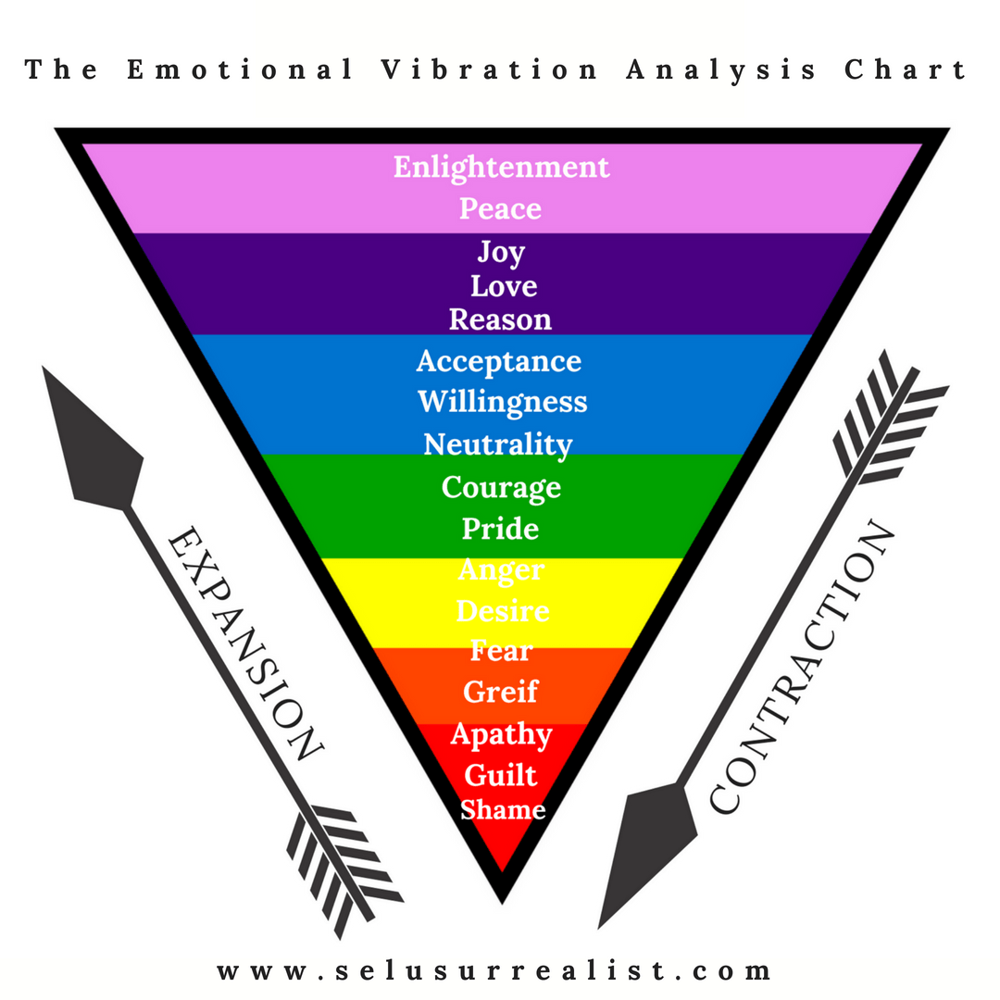
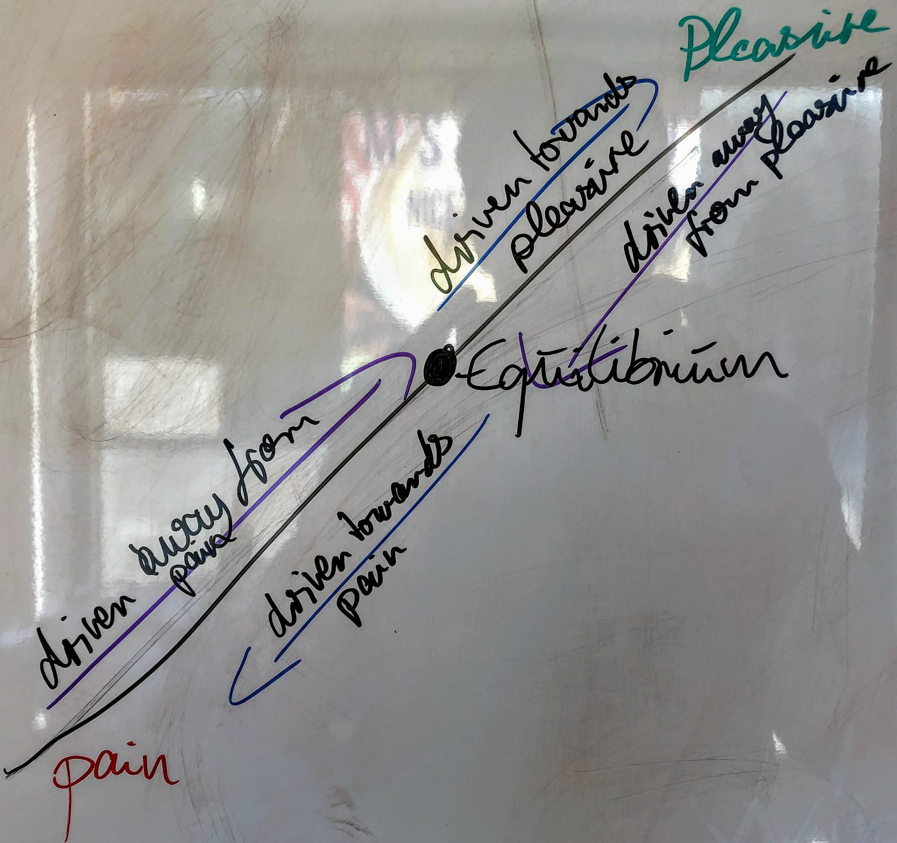
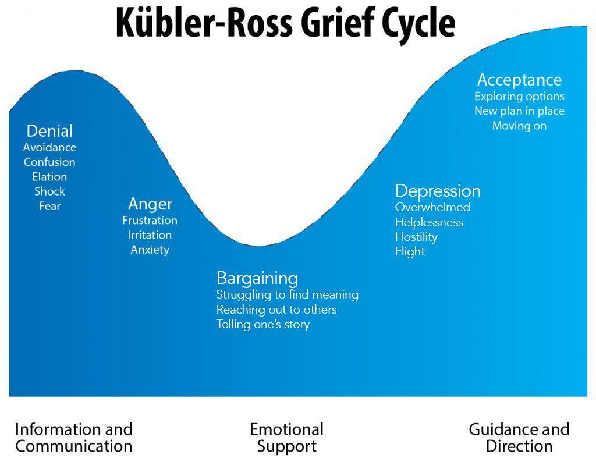
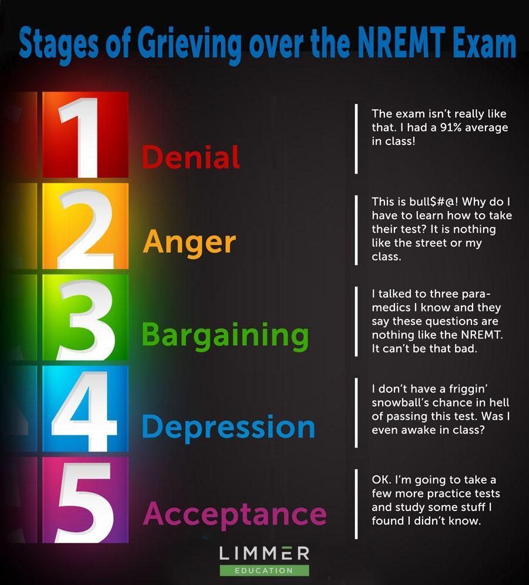

## Achieving deeper levels of fulfilment by choice

When looking at punishment and reward in terms of educational methodologies, it’s psychologically proven that rewards are more effective than punishment.[^1]

---

So far so unsurprising as pleasure promotes a higher state of being than punishment. If everything I believe in turns out to be a shared objective factual experience, that means that there is a natural drive towards a higher state of being, otherwise referred to as the good in every human being, against all odds. The following chart aims to illustrate that, even if pain and pleasure as such are not included. I believe that you know where to rank them, though.

My natural drive goes toward self-improvement and empowerment. Positive emotions are empowering. As we discover, however, it is also required to endure and move past negative emotions and face the pain experienced in that time.

---

Punishment and Reward for me are equal to pain and pleasure and I may use those interchangeably.

Punishment = Pain

Reward = Pleasure

## Distinctions

### Temporal considerations

A very important aspect, however, is the difference between the experience of pain or pleasure at this very moment or in the long term. This is where the dynamics of **instant gratification versus long term gain** come into play.

If my educational style happens to be based on punishment at this very moment, my long term intention is to raise a “good kid”. Thus short term punishment breeds long term reward.

Asking around in local fitness clubs I often hear the expression “no pain no gain”. Which is stating the desire to experience pain in the body for a toned up sexy bod. What may sound like a socially accepted form of masochism turns out to be a truism.

### Motivational considerations

Another aspect is the vector of my experience. I can be driven away from or towards pain/pleasure.

---

The arrows pointing into the other direction (driven away from pleasure or towards pain) are implied and I have no examples for them, yet, as this is ongoing research on my end. I haven’t seen anyone looking into that but suspect that these forces exist (according to Newton’s third law of motion that postulates that for each action there is an equal and opposite reaction[^2] ) and their exploration and awareness can help reach equilibrium in a more efficient manner[^3].

---

Examples:

* A deadline is fast approaching. The dire consequences of missing this deadline generate enough pain to motivate me to deliver. Just in time. This is the extrinsic motivation driving me away from pain.
* Turn this on its head. The deadline is approaching, I’m finished with my work and can afford to go over it another time to add some sparkles. This is being driven towards pleasure. This could be intrinsic or extrinsic motivation.

---

## The stages of grief and loss

According to prominent research, anyone grieving the loss of a loved one or coming out of a relationship (whether it was their choice or not) experiences 5 phases. The Kübler-Ross Grief Cycle names these as:

1. Denial
2. Anger
3. Bargaining
4. Depression
5. Acceptance

---

Let’s take the following example to understand the concept with a more practical approach:

In my experience, we all live through those stages as illustrated by the above example, from the mildest pain to the biggest trauma.[^4]

Allow me to expand on those steps as I believe the previously mentioned stages are the natural path of recovery of one wound (i.e. superficial and local healing), bringing me back to neutral or a slight increase in perceived happiness. In the following, I want to map out a path that is equivalent to a root treatment at your dentist that allows for holistic and deep healing.

---

## The journey of overcoming pain and stepping towards holistic and deep healing = pleasure

In the following, I want to paint a picture of why it is appealing to choose to sit through pain in the present moment with the intention of long term pleasure.

In our daily experience, it is all too natural to want to avoid pain. It is not pleasurable to feel pain. The mechanisms we have been trained with (especially psychologically) is the denial. Take a parent telling their kid to stop crying. This stems from a pain avoidance learned and instilled. I for one believe that the avoidance of pain is ultimately huge cruelty towards yourself and others.[^5]

In order to heal a wound, it needs treatment. How can you be able to treat a wound if you deny its existence? Or lie to yourself about the actual size and depth of the wound. Or tell yourself that it’s not that important and best to treat other’s people’s wounds first. As a therapy, you can choose the quick win of a superficial treatment with a little patch to soothe the soul or the road less travelled. Which is identifying the root cause of this pain.

It all starts with your choice to address those topics and ask your body and mind (conscious, unconscious and subconscious) to be with you and support you in the process.

Here are some affirmations that you can speak to yourself to get started:

* I am capable of transforming negative experiences into something positive.
* I am worthy of respect and equality.
* Everything works out for my highest good.
* I am opening my heart and learn to trust again.
* I am rational, balanced and know my truth.
* I speak my truth, even if my voice shakes.
* It’s okay to not be okay.
* Every emotion is legitimate. I let myself be happy, sad, frustrated and hurt. This is my experience, and I am accepting it.
* Each day, I am creating a more meaningful life.
* I am changing in positive ways. I am making peace with my past and accepting myself.
* I make healthy choices and choose to love myself every day.
* My life is divinely guided.
* I am exactly where I need to be on my journey.
* I am safe at this moment.
* Today, I choose to focus on the things I can control.
* My needs and wants are just as important as anyone else’s. I trust my instincts and listen to my inner wisdom.

Kicking it off with addressing where you deny the existence of pain in your life.[^6]

## to be continued

This is where I will continue my work on this article, describing the whole process of going trough the pain and the journey of integration. In an upcoming article I will also discuss the different coping mechanisms as well as pain and pleasure finding their expression in sexuality  .

## References

[^1]:
    [The mentality of reward and punishment in education](https://www.internationalschoolparent.com/articles/reward-punishment-education/), [Rewards & Punishments in Teaching Methods](https://www.education.gov.gy/web/index.php/teachers/tips-for-teaching/item/2116-rewards-punishments-in-teaching-methods), [About Rules, Punishments and Rewards in Education](https://www.researchgate.net/publication/270847568_About_Rules_Punishments_and_Rewards_in_Education)

[^2]:
     [Newton's Third Law](https://www.physicsclassroom.com/class/newtlaws/Lesson-4/Newton-s-Third-Law)

[^3]:
    [Are you motivated by pain or motivated by gain?](https://conorneill.com/2016/10/16/are-you-motivated-by-pain-or-motivated-by-gain/)

[^4]:
    [Mourning and the 5 Stages of Grief](https://psychcentral.com/lib/the-5-stages-of-loss-and-grief/)

[^5]:
    [How the Brain Seeks Pleasure and Avoids Pain](https://www.technologyreview.com/2017/06/27/150948/how-the-brain-seeks-pleasure-and-avoids-pain/), [Pleasure principle (psychology)](https://en.wikipedia.org/wiki/Pleasure_principle_(psychology))

[^6]:
    [Coping with emotional and psychological trauma](https://www.helpguide.org/articles/ptsd-trauma/coping-with-emotional-and-psychological-trauma.htm)
